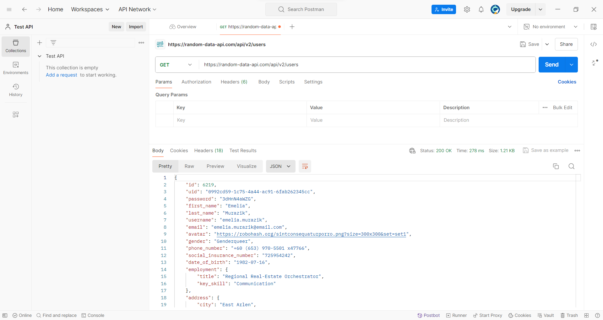

# Test-API---Postman

1. Giới thiệu về Postman:
Postman là gì?
    - Postman là một nền tảng hỗ trợ toàn diện cho việc phát triển API. Nó cung cấp cho người dùng một bộ công cụ mạnh mẽ để tạo, kiểm tra và quản lý các API. Postman được sử dụng bởi các nhà phát triển, thử nghiệm viên và quản lý API trên toàn thế giới để cải thiện quy trình làm việc và hiệu quả của họ.

Các tính năng chính của Postman
    - Gửi yêu cầu API: Postman cho phép bạn dễ dàng gửi các yêu cầu HTTP đến bất kỳ API nào, bao gồm cả GET, POST, PUT, DELETE và PATCH.
    Xem phản hồi API: Postman hiển thị phản hồi của API cho mỗi yêu cầu, bao gồm cả mã trạng thái, tiêu đề và nội dung.
    - Thử nghiệm API: Postman cung cấp một bộ công cụ toàn diện để thử nghiệm API, bao gồm khả năng tạo các trường hợp kiểm tra, khẳng định phản hồi và gỡ lỗi các yêu cầu.
    - Quản lý bộ sưu tập: Postman cho phép bạn tổ chức các yêu cầu API của mình thành các bộ sưu tập, giúp bạn dễ dàng quản lý và tái sử dụng các yêu cầu.
    - Chia sẻ API: Postman cho phép bạn chia sẻ các bộ sưu tập và yêu cầu API với những người khác, giúp bạn cộng tác dễ dàng hơn trong các dự án API.
    - Tích hợp: Postman tích hợp với nhiều công cụ phát triển phổ biến khác, chẳng hạn như GitHub, Jenkins và Travis CI.

Cách cài đặt và sử dụng Postman
    - Cài đặt Postman:
        1. Truy cập trang web https://www.postman.com/.
        2. Tải xuống ứng dụng Postman cho hệ điều hành của bạn.
        3. Cài đặt ứng dụng Postman.

    - Sử dụng Postman:
        1. Khởi chạy ứng dụng Postman.
        2. Tạo một tài khoản Postman hoặc đăng nhập bằng tài khoản hiện có.
        3. Nhấp vào nút "Tạo mới" để tạo một yêu cầu API mới.
        4. Chọn phương thức HTTP cho yêu cầu của bạn (GET, POST, PUT, DELETE, v.v.).
        5. Nhập URL của API mà bạn muốn gửi yêu cầu.
        6. Thêm bất kỳ tiêu đề hoặc nội dung nào cần thiết cho yêu cầu của bạn.
        7. Nhấp vào nút "Gửi" để gửi yêu cầu.
        8. Xem phản hồi của API.

2. Kiểm thử API cơ bản:
Gửi các yêu cầu HTTP (GET, POST, PUT, DELETE) đến API.
    Yêu cầu GET:
    

    Yêu cầu PUT:
    
Kiểm tra mã trạng thái HTTP và nội dung phản hồi.
Sử dụng các biến và bộ sưu tập dữ liệu trong Postman.
Xác minh tính hợp lệ của JSON.

